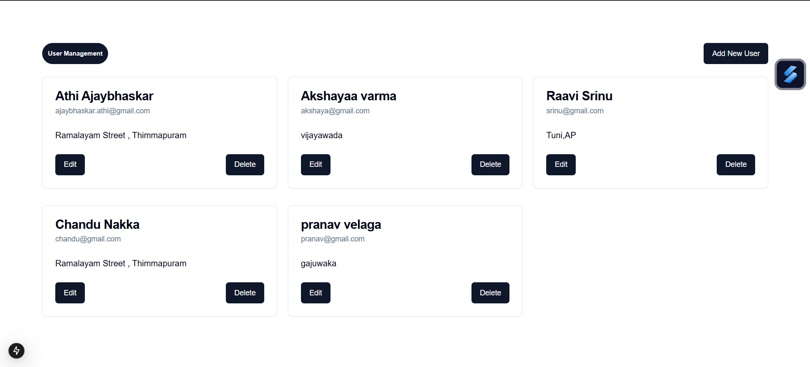
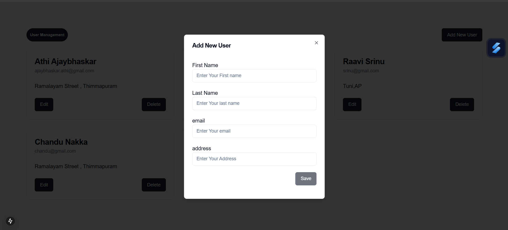
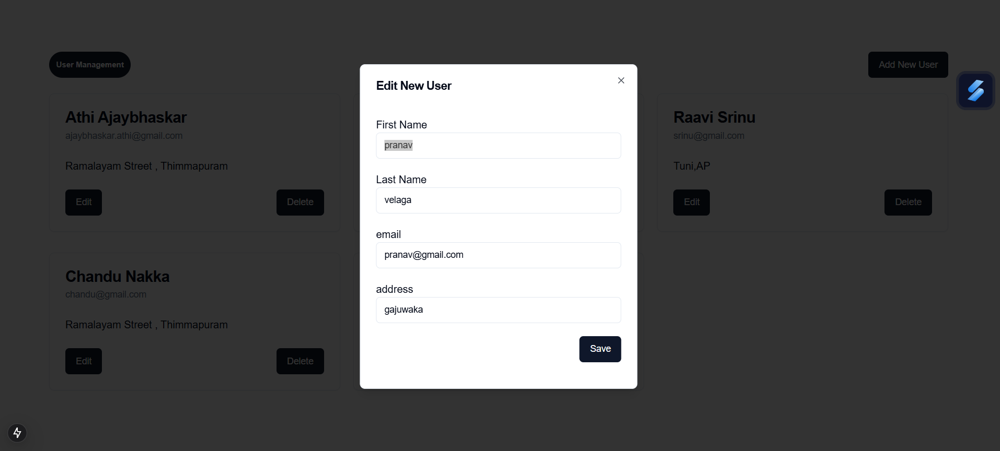

This is a [Next.js](https://nextjs.org) project bootstrapped with [`create-next-app`](https://github.com/vercel/next.js/tree/canary/packages/create-next-app).


Here’s a **README.md** template for your Basic User Manager project, including placeholders for images and the tech stack you’ve used:

# Basic User Manager NextJS (Server Actions)

## Overview
This is a basic user management system built with **Next.js** (13+), leveraging **Server Actions** and **MongoDB**. It provides functionality to add, edit, delete, and display user details such as name, last name, email, and address.

---

## Features
- Add new users with their details.
- Edit existing user information.
- Delete users from the database.
- Display all users with their details.
- Built entirely using **Server Actions** without relying on API routes.

---

## Tech Stack
- **Frontend**: Next.js (13+), Tailwind CSS, ShadCN (for UI components)
- **Backend**: Server Actions (Next.js)
- **Database**: MongoDB
- **Validation**: JOI for validating user data

---

## Screenshots

### Home Page
Displays all the users stored in the database.


### Add User
Form to add a new user with fields for name, last name, email, and address.


### Edit User
Form prefilled with the selected user’s details for easy editing.


---


## Usage
1. **Add User**: Click on the "Add User" button and fill out the form to create a new user.
2. **Edit User**: Click on the "Edit" button beside a user to update their details.
3. **Delete User**: Click on the "Delete" button beside a user to remove them from the database.


## Installation

1. Clone the repository:
   ```bash
   git clone https://github.com/Ajaybhaskar-Athi/Basic-User-Manager-NextJS-ServerActions.git
   ```

2. Navigate to the project directory:
   ```bash
   cd your-repository
   ```

3. Install dependencies:
   ```bash
   npm install
   ```

4. Create a `.env.local` file and add your MongoDB connection string:
   ```env
   MONGODB_URI=your_mongodb_connection_string
   ```

5. Start the development server:
   ```bash
   npm run dev
   ```

6. Open your browser and navigate to `http://localhost:3000`.


You can start editing the page by modifying `app/page.js`. The page auto-updates as you edit the file.

This project uses [`next/font`](https://nextjs.org/docs/app/building-your-application/optimizing/fonts) to automatically optimize and load [Geist](https://vercel.com/font), a new font family for Vercel.

## Learn More

To learn more about Next.js, take a look at the following resources:

- [Next.js Documentation](https://nextjs.org/docs) - learn about Next.js features and API.
- [Learn Next.js](https://nextjs.org/learn) - an interactive Next.js tutorial.

You can check out [the Next.js GitHub repository](https://github.com/vercel/next.js) - your feedback and contributions are welcome!

## Deploy on Vercel

The easiest way to deploy your Next.js app is to use the [Vercel Platform](https://vercel.com/new?utm_medium=default-template&filter=next.js&utm_source=create-next-app&utm_campaign=create-next-app-readme) from the creators of Next.js.

Check out our [Next.js deployment documentation](https://nextjs.org/docs/app/building-your-application/deploying) for more details.
